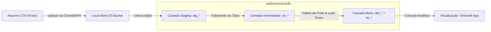
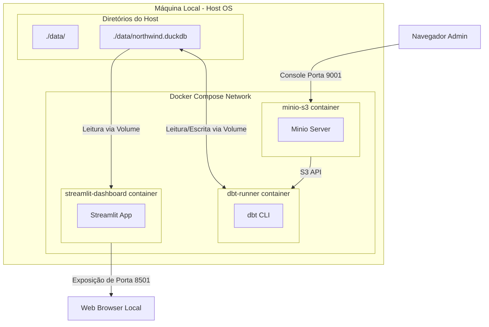

# Arquitetura da Plataforma Analítica Local - Northwind Traders

Este documento especifica a arquitetura técnica da plataforma de inteligência analítica local da Northwind Traders, desenhada sob os requisitos e restrições mapeados em [00_problem.md](file:///workspaces/sre-herluvina/documents/00_problem.md), [01_functional_requirements.md](file:///workspaces/sre-herluvina/documents/01_functional_requirements.md) e [02_non_functional_requirements.md](file:///workspaces/sre-herluvina/documents/02_non_functional_requirements.md). 

A arquitetura adota a metodologia de múltiplos pontos de vista baseada no framework **RM-ODP** (Reference Model for Open Distributed Processing), cobrindo as perspectivas Enterprise, Information, Computational, Engineering e Technology.

---

## 1. Enterprise Viewpoint (Perspectiva de Negócio)

O objetivo principal desta arquitetura é modernizar a gestão de vendas e logística da Northwind Traders sem dependência de nuvem pública (tudo local). A solução deve converter dados brutos de transações em informações para tomada de decisão estratégica e operacional, otimizando o monitoramento de margem real de lucro e eficiência nas entregas.

### 1.1. Alinhamento de Stakeholders e Objetivos
*   **Liderança Executiva**: Necessita de visibilidade da rentabilidade líquida real por categoria (subtraindo descontos e custos de frete rateados).
*   **Operações e Logística**: Focada em identificar gargalos logísticos (desvios de prazos de entrega) e performance de rotas e transportadoras.
*   **Analistas de BI**: Consumidores finais de dashboards interativos e relatórios consolidados.
*   **Engenharia de Dados & SRE**: Responsáveis pela manutenção, integridade do pipeline de dados, observabilidade de SLAs e consistência transacional.

### 1.2. Fronteiras e Limites do Sistema
*   **Escopo Interno**: Ingestão de arquivos CSV por meio de um servidor de armazenamento de objetos local (Minio), modelagem dimensional com dbt, persistência local em DuckDB, validação de qualidade de dados (SLA de dados) e camada de visualização de painéis com Streamlit.
*   **Fora de Escopo**: Sistemas de captação de pedidos (ERP), controle físico de inventário de estoque e modelos preditivos de machine learning.

---

## 2. Information Viewpoint (Perspectiva de Informação e Dados)

O fluxo de dados segue uma esteira linear que extrai dados brutos armazenados localmente e os transforma em um modelo estrela (Star Schema) otimizado para consultas analíticas complexas.

### 2.1. Fluxo de Dados e Linhagem


### 2.2. Camadas do Modelo de Dados
Todas as camadas lógicas de transformação residem no arquivo do banco de dados analítico local `northwind.duckdb`.

1.  **Camada de Staging (`stg`)**:
    *   Leitura direta dos arquivos CSV armazenados no bucket local do Minio por meio do protocolo S3 e a extensão `httpfs` do DuckDB (ex: `read_csv_auto('s3://northwind-raw/*.csv')`).
    *   Renomeação de campos para *snake_case* e tipagem correta de campos numéricos e datas.
2.  **Camada de Transição/Intermediária (`int`)**:
    *   `int_orders_calculated`: Consolida datas de envio, requerida e pedido para computar tempos logísticos e lead times.
    *   `int_order_details_allocated`: Executa a lógica de **Alocação Proporcional de Custo de Frete (RF-03)** por item de linha.
3.  **Camada de Negócio / Marts (`analytics`)**:
    *   **Modelo Dimensional (Star Schema)**:
        *   `dim_customers`: Dados históricos consolidados de clientes e regiões geográficas.
        *   `dim_products`: Cadastro de produtos com categorias associadas.
        *   `dim_employees`: Cadastro de colaboradores.
        *   `dim_shippers`: Cadastro de transportadoras parceiras.
        *   `fct_order_items`: Fato centralizada contendo quantidade, preço unitário, desconto, valor bruto, frete proporcional alocado, lucro líquido real por item e lead time associado.

---

## 3. Computational Viewpoint (Perspectiva Computacional)

Esta perspectiva descreve os componentes funcionais do sistema, suas responsabilidades e interfaces de comunicação. A solução adota o paradigma **CLI-First** (Toda a execução e testes de integridade devem ser acionáveis via terminal).

```mermaid
componentDiagram
    [Upload de Arquivos] --> [Minio Object Storage]
    [Agendador Local (Cron)] --> [Pipeline Shell Trigger: run-pipeline.sh]
    [Pipeline Shell Trigger: run-pipeline.sh] --> [dbt CLI engine]
    [dbt CLI engine] --> [dbt-duckdb Adapter]
    [dbt-duckdb Adapter] -->|httpfs S3 API| [Minio Object Storage]
    [dbt-duckdb Adapter] --> [northwind.duckdb File]
    [Streamlit Python Service] --> [DuckDB Python API]
    [DuckDB Python API] --> [northwind.duckdb File]
    [Analista / Executivo] --> [Streamlit Web UI]
```

### 3.1. Descrição dos Componentes
*   **Minio Object Storage**: Servidor local de armazenamento de objetos compatível com a API do Amazon S3. Armazena os arquivos CSV de origem de forma organizada e escalável.
*   **Pipeline Shell Trigger (`bin/run-pipeline.sh`)**: Script bash local responsável por orquestrar a sequência de comandos do pipeline, coletar métricas de execução e escrever logs de sucesso/falha.
*   **dbt CLI Engine**: Mecanismo que interpreta os modelos SQL e lógicas dimensionais, gerenciando as dependências de construção das tabelas.
*   **dbt-duckdb Adapter**: Driver que traduz os comandos do dbt em comandos SQL compatíveis com o dialeto do DuckDB e lê as fontes no Minio usando credenciais locais.
*   **Visualização (Streamlit Python Service)**: Aplicação web em Python construída nativamente para ler o arquivo do DuckDB em modo somente-leitura e expor gráficos e indicadores para os analistas.

---

## 4. Engineering Viewpoint (Perspectiva de Engenharia)

Descreve a infraestrutura física de containers e volumes montados localmente no Docker Compose para viabilizar o isolamento e execução eficiente do sistema.

### 4.1. Arquitetura de Containers e Distribuição


### 4.2. Fluxo de Execução do Pipeline e Validação de SLAs
O pipeline é executado em lote diário, orquestrado pelo cron do sistema operacional host ou gatilho manual.

1.  **Etapa de Ingestão e Transformação**: Os arquivos CSV brutos são carregados no bucket do Minio. O container `dbt-runner` é instanciado e executa `dbt run`. DuckDB lê os arquivos diretamente do Minio via HTTPFS/S3 local e materializa as tabelas dimensionais e de fatos no arquivo de banco analítico local `./data/northwind.duckdb`.
2.  **Etapa de Validação de SLA e Qualidade**: O dbt dispara o comando `dbt test`. São executados testes de chaves primárias nulas, integridade referencial, e testes de regras de negócio específicas (como checar se a data de envio é maior que a data de pedido).
3.  **Auditoria Quantitativa**: O validador compara a quantidade de linhas importadas nos marts contra os arquivos originais no Minio. Se houver desvio, o pipeline falha com código de saída `1` e emite alerta de "Perda Silenciosa de Linhas".
4.  **Consumo Analítico**: O container `streamlit-dashboard` expõe na porta `8501` o painel web de consulta conectado diretamente ao banco analítico local DuckDB.

---

## 5. Technology Viewpoint (Perspectiva de Tecnologia e Stack)

Todas as ferramentas selecionadas são open source e rodam localmente no hardware do cliente sem dependência de conexões de nuvem externa.

| Tecnologia | Versão Mínima | Finalidade do Componente |
| :--- | :--- | :--- |
| **Docker** | 24.0.0+ | Engine de execução dos containers locais |
| **Docker Compose** | v2.20.0+ | Orquestração dos serviços de runtime locais |
| **Minio** | RELEASE.2024+ | Armazenamento de arquivos local compatível com S3 |
| **Python** | 3.11+ | Linguagem base para execução do dbt e do Streamlit |
| **DuckDB** | 0.10.0+ | Banco de dados analítico local (OLAP) e motor de execução de SQL |
| **dbt-duckdb** | 1.7.0+ | Adaptador dbt para execução de transformações no DuckDB |
| **Streamlit** | 1.30.0+ | Framework Python para construção do dashboard interativo de BI |
| **Bash Shell** | 4.0+ | Automação de execução CLI do pipeline e cron |

---

## 6. Registros de Decisões de Arquitetura (Architecture Decision Records)

### ADR-03: Escolha do DuckDB como Motor OLAP Principal
*   **Status**: Aprovado.
*   **Contexto**: A Northwind precisa processar localmente volumes diários de transações em CSV para responder a perguntas financeiras e logísticas com restrição de processamento diário rápido (RNF-03).
*   **Decisão**: Substituir o uso de um servidor PostgreSQL completo local pelo DuckDB como banco OLAP.
*   **Justificativa**: O DuckDB é um banco de dados embutido otimizado para cargas OLAP de alta performance. Ele lê arquivos brutos de forma ultra-rápida (vetorizada), eliminando a necessidade de complexos scripts Python de carregamento linha-a-linha no banco e garantindo menor uso de CPU e memória local do Host.

### ADR-04: Uso do dbt (Data Build Tool) para Transformações de Dados
*   **Status**: Aprovado.
*   **Contexto**: O projeto exige consistência temporal, validação rigorosa de qualidade de dados (RF-08, RF-09, RNF-01, RNF-02) e rastreabilidade clara de transformações.
*   **Decisão**: Adotar o dbt para estruturar as transformações de dados em camadas (staging, intermediate, marts).
*   **Justificativa**: O dbt permite versionar consultas SQL como modelos físicos, gerencia dependências automaticamente e possui um framework nativo de testes de qualidade de dados. Isso remove a necessidade de construir engines de teste e controle de linhagem customizados em scripts Python puros.

### ADR-05: Escolha do Streamlit para Visualização Analítica
*   **Status**: Aprovado.
*   **Contexto**: É necessário disponibilizar KPIs e análises gráficas para analistas e diretoria de forma interativa, visualmente limpa e conectável ao banco DuckDB local.
*   **Decisão**: Adotar o Streamlit executando em container Docker exposto na máquina local.
*   **Justificativa**: O Streamlit permite criar painéis analíticos diretamente em Python. Ele se conecta de forma nativa e rápida à biblioteca do DuckDB na mesma stack da aplicação, possuindo menor consumo de hardware e memória do host do que uma ferramenta tradicional completa como o Metabase (baseada em JVM/Java), além de ser altamente customizável via código.

### ADR-06: Uso de Docker Compose para Isolamento Local
*   **Status**: Aprovado.
*   **Contexto**: A plataforma analítica deve coexistir no ambiente de trabalho local dos desenvolvedores e analistas sem gerar conflitos de dependências de sistema ou pacotes Python.
*   **Decisão**: Containerizar as execuções do dbt e do dashboard do Streamlit em containers isolados via Docker Compose.
*   **Justificativa**: O Docker garante portabilidade e repetibilidade absoluta das execuções do pipeline. O banco analítico local é compartilhado de forma segura via montagem de volumes, isolando a infraestrutura das dependências do sistema operacional do host.

### ADR-07: Adoção do Minio como Armazenamento de Objetos S3 Local
*   **Status**: Aprovado.
*   **Contexto**: É necessário estruturar a recepção de dados brutos imitando uma arquitetura de data lake corporativa em nuvem, mantendo o controle sobre o versionamento dos arquivos de origem de forma local e organizada.
*   **Decisão**: Configurar e rodar um container local do Minio para gerenciar os buckets de arquivos raw em S3 compatível.
*   **Justificativa**: O Minio fornece uma API robusta de armazenamento de objetos compatível com S3. Ao invés de lidar com montagens de volumes de arquivos físicos diretos e instáveis, o pipeline e o dbt usam o protocolo S3 nativo do dbt-duckdb (HTTPFS), simplificando a replicação de lógicas de data lake na infraestrutura local do cliente de forma idêntica à nuvem.

---

## 7. Riscos e Ambiguidades de Arquitetura

### Riscos de Engenharia de Dados (3)
1.  **Concorrência de Acesso ao Banco Local (DuckDB R/W)**: O DuckDB é otimizado para acesso monousuário de escrita. Se um processo de transformação do dbt estiver escrevendo no arquivo `northwind.duckdb`, o container do Streamlit (leitor) poderá receber um erro de bloqueio de arquivo (*locked process*). O risco deve ser mitigado forçando o Streamlit a conectar em modo leitura-compartilhada (`read_only=True`).
2.  **Overhead de Rede na Comunicação Local com o Minio**: Ler arquivos do Minio via requisições HTTP (protocolo S3) em containers locais pode introduzir latência adicional quando comparado à leitura direta de arquivos físicos do Host OS no DuckDB.
3.  **Vazamento de Chaves de Acesso do Minio**: Como o dbt precisa de credenciais do S3 (`AWS_ACCESS_KEY_ID` e `AWS_SECRET_ACCESS_KEY`) para conectar no Minio, chaves estáticas de teste podem ser expostas se configuradas direto no repositório (mitigar via carregamento de variáveis de ambiente no container).

### Ambiguidades Pendentes (2)
1.  **Controle de Retenção de Arquivos no Minio**: Não há especificação sobre políticas de versionamento e retenção de arquivos no bucket do Minio. Se os arquivos CSV diários forem acumulados infinitamente sem expurgo, o volume do container do Minio pode exaurir o armazenamento em disco do host.
2.  **Garantia de Uptime do Container Minio**: Permanece ambíguo como será garantida a alta disponibilidade do container do Minio local contra reinicializações inesperadas ou corrupção de volume, afetando a resiliência global do pipeline de ingestão diário.

---
*Fim do Documento de Arquitetura.*