# Plano de Testes de Carga e Performance - Northwind Traders

Este documento especifica o plano de testes de carga e performance para a plataforma de inteligência analítica local da Northwind Traders. O plano descreve a estratégia de validação dos limites operacionais do ecossistema local (compreendendo o servidor de objetos MinIO, o processamento analítico com DuckDB e dbt, e a visualização com Streamlit), com foco na garantia de conformidade com os Requisitos Não Funcionais (RNFs) de desempenho e confiabilidade definidos em [02_non_functional_requirements.md](file:///workspaces/sre-herluvina/documents/02_non_functional_requirements.md).

Como o sistema é executado inteiramente em ambiente local (*on-premises* ou máquina de desenvolvimento) sob as restrições de [00_problem.md](file:///workspaces/sre-herluvina/documents/00_problem.md), a estratégia de testes prioriza simulações de concorrência local e eficiência de I/O em disco.

---

## 1. Identificação de Cenários Críticos de Performance

Os seguintes cenários operacionais representam os gargalos críticos da plataforma analítica local:

1.  **Concorrência de Leitura/Escrita no DuckDB**: O DuckDB é um banco de dados embutido (*embedded*) otimizado para cargas analíticas (OLAP). Ele permite múltiplos leitores simultâneos, mas bloqueia o arquivo inteiro (`northwind.duckdb`) para gravação exclusiva durante operações de escrita. Executar a ingestão e transformações do dbt simultaneamente com o acesso de analistas no Streamlit pode gerar contenção de locks de arquivo.
2.  **Saturação de I/O de Disco Host**: A ingestão de grandes volumes de dados brutos (arquivos CSV) do MinIO local e a materialização das tabelas no DuckDB exigem alta vazão de leitura e escrita em disco. Em discos magnéticos convencionais (HDs) ou ambientes de virtualização limitados, a latência de disco pode degradar o tempo de execução do pipeline.
3.  **Concorrência de Usuários no Streamlit**: O Streamlit gerencia conexões de usuários em threads dedicadas e utiliza conexões WebSocket para atualizar o estado do dashboard. Sob carga simultânea, o consumo de memória do processo Python do Streamlit pode crescer exponencialmente, concorrendo com os recursos do banco de dados e orquestrador no mesmo host.

---

## 2. Especificação dos Tipos de Teste (k6)

Para cobrir estes cenários e validar a resiliência do sistema, foram definidos 4 tipos de testes utilizando a ferramenta **k6**.

```mermaid
gantt
    title Perfis de Carga dos Testes (k6)
    dateFormat  X
    axisFormat %s
    
    section Load Test (Concorrência Normal)
    Ramp-up (0-20 VUs) : active, 0, 120
    Sustentado (20 VUs) : active, 120, 900
    
    section Soak Test (Resistência e Vazamentos)
    Sustentado (10 VUs) : active, 0, 14400
    
    section Spike Test (Pico Instantâneo)
    Ramp-up Rápido (0-100 VUs) : active, 0, 30
    Pico (100 VUs) : active, 30, 570
    
    section Stress Test (Ponto de Quebra)
    Escada (10-300 VUs) : active, 0, 1200
```



---

### TC-24: Teste de Carga (Load Test) - Coexistência de Leitura/Escrita
*   **ID do Teste**: `TC-24`
*   **RNF Coberto**: 
    *   **RNF-05 (Coexistência de Concorrência)**:
        *   *Valor/SLO*: 0% de consultas analíticas interrompidas por timeout de contenção de escrita.
        *   *Unidade*: Percentual (%) de consultas interrompidas.
        *   *Janela*: 15 minutos (tempo de execução do teste).
        *   *Fonte*: Logs de sessões e erros do DuckDB/Streamlit.
    *   **RNF-07 (Tempo de Resposta para Consultas Analíticas)**:
        *   *Valor/SLO*: <= 5.0 segundos no percentil 95 (P95).
        *   *Unidade*: Segundos.
        *   *Janela*: Janela de execução do teste.
        *   *Fonte*: Métricas de duração de requisição HTTP/WS registradas pelo k6.
*   **Hipótese**: O banco de dados analítico local `northwind.duckdb` montado em modo leitura compartilhada pelo Streamlit suporta consultas de agregação financeiras concorrentes sem gerar interrupções ou timeouts por lock, mesmo enquanto o pipeline de dados (`run-pipeline.sh`) está executando cargas e escritas em lote de 50.000 registros.
*   **Ferramenta**: `k6` + script bash acionador do pipeline local.
*   **Volume**: 20 usuários virtuais concorrentes (VUs) acessando e filtrando painéis no Streamlit, simulando uma taxa constante de 5 requisições de consulta por segundo (RPS), paralelamente à execução de 1 ciclo completo do pipeline de dados carregando 50.000 linhas de transações.
*   **Duração**: 15 minutos (com ramp-up de 2 minutos, 11 minutos de carga estável e 2 minutos de ramp-down).
*   **Métricas de Sucesso**:
    1.  Taxa de erro de requisições de consulta HTTP/WS = 0.00% (nenhuma consulta falha por lock de escrita do DuckDB).
    2.  Tempo de resposta para requisições analíticas (P95) <= 5.0 segundos.
    3.  Tempo de execução do pipeline (`run-pipeline.sh`) sob concorrência <= 45 minutos (RNF-03).

---

### TC-25: Teste de Soak (Soak Test) - Estabilidade e Vazamento de Recursos
*   **ID do Teste**: `TC-25`
*   **RNF Coberto**:
    *   **RNF-09 (Disponibilidade do Repositório Analítico Local)**:
        *   *Valor/SLO*: >= 99.0% de tempo de atividade (Uptime).
        *   *Unidade*: Percentual (%) de requisições bem-sucedidas.
        *   *Janela*: 4 horas (execução do teste).
        *   *Fonte*: Health checks do container e estatísticas de rede do k6.
    *   **RNF-07 (Tempo de Resposta para Consultas Analíticas)**:
        *   *Valor/SLO*: <= 5.0 segundos no percentil 95 (P95).
        *   *Unidade*: Segundos.
        *   *Janela*: 4 horas (janela do teste).
        *   *Fonte*: Relatório consolidado do k6.
*   **Hipótese**: O processo do Streamlit e a conexão local embarcada do DuckDB mantêm a estabilidade do uso de memória e CPU do host, não apresentando vazamento de recursos (*resource leaks*) nem degradação progressiva no tempo de resposta das consultas sob atividade contínua de usuários de BI.
*   **Ferramenta**: `k6` + Script de monitoramento de recursos do Docker Host (`docker stats`).
*   **Volume**: 10 usuários virtuais concorrentes (VUs) realizando cliques e filtros analíticos sequenciais no dashboard em loop contínuo.
*   **Duração**: 4 horas.
*   **Métricas de Sucesso**:
    1.  Disponibilidade média do Streamlit/DuckDB >= 99.0% (taxa de erros de rede ou servidor < 1.0%).
    2.  O consumo de memória RAM do container do Streamlit não exibe tendência linear de crescimento (limite de flutuação de +/- 10% após os primeiros 15 minutos).
    3.  A diferença entre o tempo médio de resposta no P95 dos primeiros 10 minutos de teste e dos últimos 10 minutos é inferior a 15% (sem degradação progressiva).

---

### TC-26: Teste de Spike (Spike Test) - Surto Instantâneo de Trabalho
*   **ID do Teste**: `TC-26`
*   **RNF Coberto**:
    *   **RNF-09 (Disponibilidade do Repositório Analítico Local)**:
        *   *Valor/SLO*: >= 99.0% de Uptime.
        *   *Unidade*: Percentual (%) de tempo ativo e aceitando conexões.
        *   *Janela*: Janela de 10 minutos do teste.
        *   *Fonte*: Status e logs do container local.
    *   **RNF-03 (Tempo de Execução do Pipeline)**:
        *   *Valor/SLO*: <= 45 minutos.
        *   *Unidade*: Minutos.
        *   *Janela*: Execução do pipeline sob concorrência do spike.
        *   *Fonte*: Timestamps gravados na tabela de auditoria.
*   **Hipótese**: O ecossistema local absorve um pico abrupto e simultâneo de requisições de analistas ao mesmo tempo em que recebe uma carga pesada de ingestão não planejada (ex: recarga histórica de 250.000 linhas), recuperando a estabilidade operacional sem travamento de containers ou interrupção permanente de serviços.
*   **Ferramenta**: `k6` acionando requisições paralelas + trigger de ingestão histórica via CLI.
*   **Volume**: Subida rápida de 0 para 100 usuários virtuais (VUs) concorrentes em apenas 30 segundos, mantendo a carga por 9 minutos e retornando a 0 VUs em 30 segundos. Paralelamente, no segundo minuto do teste, é iniciado um processamento de pipeline contendo 5 vezes o volume diário normal de dados (250.000 registros).
*   **Duração**: 10 minutos.
*   **Métricas de Sucesso**:
    1.  Nenhum container Docker reinicia ou falha com erro de falta de memória (OOM Killer).
    2.  Uptime de aceitação de conexões >= 99.0% durante todo o pico.
    3.  Tempo de execução do pipeline estressado de 250k linhas é finalizado com sucesso em <= 45 minutos.
    4.  O tempo de resposta do dashboard retorna para <= 5.0 segundos (P95) em até 60 segundos após a conclusão do pipeline concorrente.

---

### TC-27: Teste de Estresse (Stress Test) - Limite de Saturação Local
*   **ID do Teste**: `TC-27`
*   **RNF Coberto**:
    *   **RNF-07 (Tempo de Resposta para Consultas Analíticas)**:
        *   *Valor/SLO*: Determinação do ponto exato de saturação (onde o tempo de resposta do SLO de 5s é quebrado de forma persistente).
        *   *Unidade*: Segundos / Número de VUs simultâneos.
        *   *Janela*: 20 minutos (janela do teste).
        *   *Fonte*: Telemetria do k6.
    *   **RNF-09 (Disponibilidade do Repositório Analítico Local)**:
        *   *Valor/SLO*: Identificação do ponto de falha catastrófica (crash/timeout geral).
        *   *Unidade*: Percentual de sucesso de chamadas.
        *   *Janela*: 20 minutos.
        *   *Fonte*: Status dos containers Docker.
*   **Hipótese**: Sob condições de estresse extremo que excedam os recursos normais do host local, o ecossistema degrada o desempenho de forma controlada (gerando filas e timeouts lentos) em vez de causar corrupção física do arquivo de banco de dados DuckDB ou travamento geral do sistema de arquivos do Host OS.
*   **Ferramenta**: `k6` com incremento em escada.
*   **Volume**: Crescimento progressivo em passos de 50 VUs a cada 2 minutos, partindo de 10 VUs até atingir o limite de 300 VUs concorrentes, com volume de dados no DuckDB inflado previamente para 1.000.000 de registros analíticos.
*   **Duração**: 20 minutos.
*   **Métricas de Sucesso**:
    1.  Mapeamento claro do limite de saturação (limite de VUs onde a latência P95 passa de 5.0s para > 15.0s ou a taxa de erros excede 5%).
    2.  O arquivo do banco de dados analítico local `northwind.duckdb` permanece legível e sem corrupção após o término do teste (valida-se rodando uma consulta de verificação de integridade pós-estresse).
    3.  A taxa de erros de conexões recusadas (connection refused) ocorre em nível de aplicação (Streamlit/Webserver) sem afetar o daemon Docker ou reiniciar o host físico.

---

## 3. Especificações Técnicas e Scripts k6

Abaixo estão descritas as estruturas e lógicas dos scripts `k6` planejados para validação local.

### 3.1. Modelo do Script k6 para Teste de Carga de Consultas (Streamlit App)

Este script simula o comportamento de analistas no Streamlit, realizando chamadas analíticas à porta exposta (`8501`). Ele será configurado para simular a navegação e o consumo de dados analíticos:

```javascript
import http from 'k6/http';
import { check, sleep } from 'k6';

// Configuração dos parâmetros do teste (pode ser sobrescrito por CLI)
export const options = {
  stages: [
    { duration: '2m', target: 20 }, // Ramp-up para 20 VUs
    { duration: '11m', target: 20 }, // Carga estável com 20 VUs
    { duration: '2m', target: 0 },  // Ramp-down para 0 VUs
  ],
  thresholds: {
    http_req_failed: ['rate<0.01'], // RNF-05/RNF-09: menos de 1% de falhas
    http_req_duration: ['p(95)<5000'], // RNF-07: P95 abaixo de 5s (5000ms)
  },
};

const BASE_URL = __ENV.TARGET_URL || 'http://localhost:8501';

export default function () {
  // 1. Simula requisição inicial do dashboard
  let resPage = http.get(BASE_URL);
  check(resPage, {
    'home page status is 200': (r) => r.status === 200,
    'streamlit loaded': (r) => r.body.includes('streamlit') || r.status === 200,
  });
  sleep(1);

  // 2. Simula chamada de query analítica (filtrando por margem financeira e categoria)
  // Nota: Streamlit usa tráfego WebSocket/HTTP POST para atualizar dados internos.
  // Simulamos a requisição de atualização de dados contendo o payload do filtro analítico.
  let payload = JSON.stringify({
    category: 'Beverages',
    min_profitability: 0.15,
  });

  let params = {
    headers: {
      'Content-Type': 'application/json',
    },
  };

  let resQuery = http.post(`${BASE_URL}/_stcore/message`, payload, params);
  check(resQuery, {
    'query execution status is 200': (r) => r.status === 200,
  });

  sleep(Math.random() * 4 + 2); // Tempo de leitura do analista (pensamento: 2 a 6 segundos)
}
```

### 3.2. Script Shell de Execução Concorrente de Escrita (Pipeline)

Para executar o **TC-24 (Load Test)** de concorrência, o testador deve disparar o pipeline de dados enquanto o script k6 acima está ativo:

```bash
#!/bin/bash
# run-load-test-concurrency.sh
# Finalidade: Executar testes de concorrência de escrita local sob carga de queries analíticas.

echo "Iniciando monitoramento de performance com k6..."
k6 run --env TARGET_URL=http://localhost:8501 documents/scripts/load_test.js &
K6_PID=$!

echo "Aguardando 2 minutos para ramp-up do k6 atingir estabilidade (20 VUs)..."
sleep 120

echo "Disparando pipeline de ingestão e transformação local (DuckDB Write Lock)..."
START_TIME=$(date +%s)

# Executa o orquestrador do pipeline
/bin/bash bin/run-pipeline.sh

PIPELINE_STATUS=$?
END_TIME=$(date +%s)
ELAPSED=$((END_TIME - START_TIME))

echo "Pipeline finalizado em $ELAPSED segundos com código de saída $PIPELINE_STATUS"

# Aguarda a finalização do k6
wait $K6_PID

# Valida RNF-03 (ETL Completo <= 45 minutos / 2700s)
if [ $ELAPSED -le 2700 ] && [ $PIPELINE_STATUS -eq 0 ]; then
  echo "Sucesso: O pipeline rodou dentro do SLO e sem erros sob concorrência local."
  exit 0
else
  echo "Falha: O pipeline estourou o SLO de tempo ou apresentou erros de concorrência."
  exit 1
fi
```

---

## 4. Tabela de Relação com RNFs e Cobertura

Abaixo está o mapeamento dos novos cenários de testes de performance (`TC-24` a `TC-27`) com os Requisitos Não Funcionais (RNFs) já mapeados na matriz de rastreabilidade corporativa.

| Cenário de Teste (ID) | Tipo de Teste | RNF Primário Coberto | SLO Alvo / Métrica de Sucesso | Fonte de Medição de Sucesso |
| :--- | :--- | :--- | :--- | :--- |
| **TC-24** | Load Test | **RNF-05** (Coexistência)<br>**RNF-07** (Tempo de Resposta) | 0% erros por lock exclusivo de escrita.<br>Tempo de query P95 <= 5.0 segundos. | Logs do DuckDB / Telemetria k6 |
| **TC-25** | Soak Test | **RNF-09** (Disponibilidade)<br>**RNF-07** (Tempo de Resposta) | >= 99.0% Uptime por 4 horas analíticas.<br>Desvio de latência P95 inicial/final < 15%. | Logs do Host (`docker stats`) / k6 |
| **TC-26** | Spike Test | **RNF-09** (Disponibilidade)<br>**RNF-03** (Tempo do Pipeline) | Sem falhas de OOM Killer no Docker Host.<br>Pipeline concluído em <= 45 minutos. | Auditoria de Logs / Timestamps do DB |
| **TC-27** | Stress Test | **RNF-07** (Tempo de Resposta)<br>**RNF-09** (Disponibilidade) | Identificar limite de VUs de quebra.<br>Garantia de 0% corrupção do `northwind.duckdb`. | k6 metrics / Script de Integridade SQL |

---

## 5. Riscos e Ambiguidades

Abaixo estão descritos os riscos técnicos de execução e as ambiguidades identificadas no planejamento deste plano de testes de carga.

### Riscos de Execução dos Testes (3)
1.  **Impossibilidade de Simulação Fiel de Rede Local no Host Virtualizado**: O k6 rodará na mesma máquina local (ou container compartilhado) que hospeda o Streamlit e o DuckDB. A latência de rede será virtualmente zero (loopback local), mascarando o impacto real que a rede física de escritório (WiFi corporativa ou VPN) traria para a renderização do Streamlit e tráfego WebSocket.
2.  **Desgaste de Armazenamento SSD Local por Carga Repetitiva**: Testes persistentes de estresse (como o Spike com 250k linhas e o Stress com 1M+ linhas) realizam gravações contínuas de gigabytes no DuckDB e upload/download no MinIO. A execução recorrente destes cenários em ambientes locais de desenvolvimento reduz a vida útil dos SSDs físicos por causa do alto ciclo de I/O de escrita.
3.  **Falsos Positivos causados por Recursos Compartilhados no Host OS**: Se o desenvolvedor ou servidor de testes executar tarefas pesadas em segundo plano (compilação de código, antivírus, atualizações do SO) durante os testes de performance, os SLOs de latência (RNF-07) e tempo de pipeline (RNF-03) podem falhar por falta de CPU do hardware hospedeiro, e não por ineficiência do software analítico.

### Ambiguidades do Escopo de Carga (2)
1.  **Falta de Perfil Histórico de Queries de Usuários Analíticos**: Não há um padrão definido sobre quais relatórios do Streamlit os usuários clicam mais. Dizer que o teste simula "cliques e filtros analíticos sequenciais" (TC-25 e TC-27) é ambíguo. Se o teste simular apenas consultas simples de leitura em dimensões (`dim_shippers`) ao invés de agregações pesadas em fatos (`fct_order_items` com junções), o resultado do teste de latência e consumo de CPU será artificialmente otimista.
2.  **Critério de Limite de Conexões WebSocket do Streamlit**: O Streamlit não segue o modelo tradicional de requisições stateless (HTTP REST). Ele abre uma conexão persistente WebSocket para cada aba aberta do navegador. O plano prevê até 300 VUs para teste de estresse (TC-27), porém não há clareza se o servidor Streamlit local padrão está parametrizado para aceitar mais de 100 conexões de WebSocket simultâneas sem derrubar a porta de escuta por limites de descritores de arquivos (*file descriptors*) do Host OS.

---
*Fim do Documento do Plano de Testes de Carga.*
