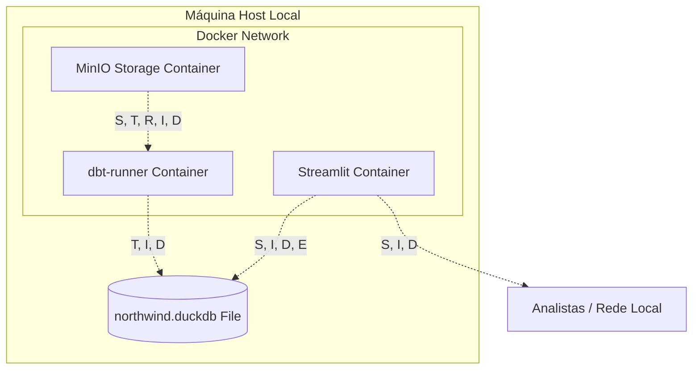
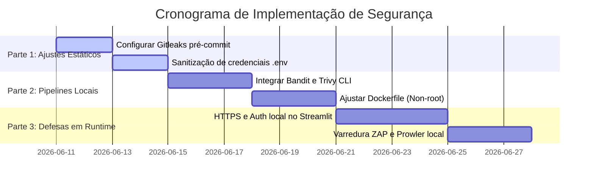

# Plano de Testes e Análise de Segurança - Northwind Traders

Este documento especifica o plano de testes e a análise de segurança da plataforma analítica local da Northwind Traders. O plano é estruturado sob o modelo de modelagem de ameaças **STRIDE** e os riscos do **OWASP Top 10**, definindo os casos de teste de segurança (**TC-SEC-NN**) e um cronograma de implementação em partes para mitigar as vulnerabilidades identificadas.

Dado o requisito de negócio "tudo local" (on-premises) estabelecido em [00_problem.md](file:///workspaces/sre-herluvina/documents/00_problem.md), a segurança foca no isolamento de containers, segurança do host local, controle de acesso à rede interna de escritório e prevenção contra o vazamento de segredos no código-fonte.

---

## 1. Análise de Ameaças STRIDE por Componente

Aplicando o framework STRIDE (Spoofing, Tampering, Repudiation, Information Disclosure, Denial of Service, Elevation of Privilege) sobre a arquitetura local definida em [03_architecture.md](file:///workspaces/sre-herluvina/documents/03_architecture.md):

---

### 1.1. MinIO Object Storage (S3 API Local)
*   **Spoofing (Usurpação)**: Um atacante na mesma rede de escritório pode se passar pela API do MinIO se a porta `9000` estiver exposta sem autenticação estrita ou se as chaves de acesso padrão (`minioadmin`) forem mantidas.
*   **Tampering (Adulteração)**: Modificação direta dos arquivos CSV brutos armazenados nos volumes físicos mapeados no host local, injetando linhas falsas antes da execução do pipeline.
*   **Repudiation (Repúdio)**: O MinIO local não possui auditoria estruturada habilitada de escrita/leitura de objetos (logs de acesso S3), inviabilizando rastrear quem enviou ou deletou um arquivo CSV.
*   **Information Disclosure (Vazamento)**: Leitura não autorizada de dados de vendas confidenciais através da console web exposta na porta `9001` sem HTTPS (tráfego de rede local em texto plano).
*   **Denial of Service (Negação)**: Exaustão de espaço em disco no Host através do envio contínuo de arquivos gigantes via API do S3 compatível.
*   **Elevation of Privilege (Elevação)**: Exploração de falha de segurança no binário do MinIO para obter execução de código como root no container.

---

### 1.2. Pipeline Shell Trigger & Python dbt-runner (Orquestrador)
*   **Spoofing (Usurpação)**: Substituição maliciosa do script `bin/run-pipeline.sh` por um script modificado que desvia os dados ou injeta backdoors.
*   **Tampering (Adulteração)**: Modificação do código SQL dos modelos dbt em staging/intermediate para inflar ou desviar cálculos financeiros (ex: descontos).
*   **Repudiation (Repúdio)**: Execuções do dbt rodando no cron do host local registram logs em formato genérico de sistema de arquivos, sem vincular a ação ao desenvolvedor que alterou o código.
*   **Information Disclosure (Vazamento)**: Vazamento de variáveis de ambiente (`AWS_ACCESS_KEY_ID` e `AWS_SECRET_ACCESS_KEY`) em arquivos de log gerados pelo dbt no diretório público local.
*   **Denial of Service (Negação)**: Injeção de loops infinitos em scripts de transformação Python (ex: `app/audit.py`), paralisando a CPU do host de desenvolvimento.
*   **Elevation of Privilege (Elevação)**: Execução do container `dbt-runner` como usuário `root`, permitindo que um atacante que comprometa o container explore montagens de volume para acessar arquivos do Host OS.

---

### 1.3. northwind.duckdb (Banco de Dados Embarcado)
*   **Spoofing (Usurpação)**: Processos não autorizados acessando e escrevendo no arquivo `northwind.duckdb` diretamente pelo host, burlando a validação lógica do dbt.
*   **Tampering (Adulteração)**: Alteração direta e silenciosa do arquivo binário no disco, burlando triggers e logs de auditoria DML.
*   **Repudiation (Repúdio)**: Por ser um banco embutido (*in-process*), o DuckDB não registra histórico centralizado ou trilha de auditoria padrão de transações.
*   **Information Disclosure (Vazamento)**: Cópia simples do arquivo físico `.duckdb` por um usuário com acesso ao host, permitindo extrair toda a base de dados corporativa.
*   **Denial of Service (Negação)**: Bloqueio persistente de arquivo por um processo de escrita abortado, gerando travamento permanente (locked process) de todas as queries de leitura do Streamlit.
*   **Elevation of Privilege (Elevação)**: Exploração da extensão `httpfs` do DuckDB para ler arquivos protegidos do host local (ex: `/etc/passwd`) usando comandos SQL.

---

### 1.4. Streamlit Web Dashboard (Visualização na Porta 8501)
*   **Spoofing (Usurpação)**: Acesso de usuários externos ao painel financeiro sem autenticação corporativa (Streamlit exposto livremente na rede interna).
*   **Tampering (Adulteração)**: Injeção de scripts no navegador de analistas (Cross-Site Scripting - XSS) através de campos de filtros do Streamlit não sanitizados.
*   **Repudiation (Repúdio)**: Ausência de logs de acesso de quem visualizou informações críticas de rentabilidade líquida corporativa.
*   **Information Disclosure (Vazamento)**: Exposição de erros de SQL detalhados na interface do usuário em caso de falha de conexão, revelando a estrutura interna do DuckDB.
*   **Denial of Service (Negação)**: Esgotamento de memória RAM no host local através do disparo de dezenas de conexões WebSocket concorrentes em navegadores distintos.
*   **Elevation of Privilege (Elevação)**: Injeção de comandos de shell no host a partir de inputs dinâmicos do painel.

---

## 2. OWASP Top 10 Aplicável ao Ecossistema Local

Foram mapeadas as vulnerabilidades do OWASP Top 10 mais críticas para a stack analítica local da Northwind Traders:

1.  **A01:2021-Broken Access Control (Controle de Acesso Quebrado)**:
    *   *Risco*: A ausência de autenticação e controle de permissões em nível de linha (*Row Level Security - RLS*) no painel do Streamlit expõe KPIs financeiros a qualquer usuário que acesse o endereço IP local na porta `8501`.
2.  **A02:2021-Cryptographic Failures (Falhas de Criptografia)**:
    *   *Risco*: Tráfego de credenciais de S3 e dados de vendas em texto claro (HTTP sem SSL/TLS) entre os containers locais e a máquina host, passível de interceptação (*sniffing*) na rede do escritório.
3.  **A03:2021-Injection (Injeção)**:
    *   *Risco*: Consultas dinâmicas no painel Streamlit construídas por concatenação direta de strings podem permitir injeção de SQL no DuckDB, abrindo brecha para deleção de tabelas analíticas ou leitura de arquivos do host local via comando `COPY`.
4.  **A05:2021-Security Misconfiguration (Configuração Incorreta)**:
    *   *Risco*: Uso de credenciais de fábrica (`minioadmin` / `minioadmin`) no MinIO local e execução de containers Docker em modo privilegiado ou como usuário `root`.
5.  **A06:2021-Vulnerable and Outdated Components (Componentes Desatualizados/Vulneráveis)**:
    *   *Risco*: Uso de pacotes python (como bibliotecas do dbt-duckdb ou Streamlit) com vulnerabilidades conhecidas (CVEs) não corrigidas no repositório.

---

## 3. Tabela de Casos de Teste de Segurança (TC-SEC-NN)

Abaixo estão definidos os casos de teste automatizados de segurança mapeados para os RNFs do projeto:

| ID | Tipo de Teste | Ferramenta | Objetivo / Escopo do Teste | RNF Coberto (Mapeamento Mensurável) |
| :--- | :--- | :--- | :--- | :--- |
| **TC-SEC-01** | SAST | **Bandit** | Analisar estaticamente o código Python (`app/`) para identificar falhas de injeção SQL, uso de funções perigosas (`exec`/`eval`) e senhas chumbadas. | **RNF-10 (Segurança - Credenciais)** - *SLO*: 0 segredos expostos no código. - *Unidade*: Contagem absoluta. - *Janela*: A cada commit/scan. - *Fonte*: Relatório do Bandit. |
| **TC-SEC-02** | SCA | **Trivy** | Escanear dependências do `requirements.txt` e imagens base do Docker para identificar bibliotecas desatualizadas com CVEs críticas/altas. | **RNF-14 (Portabilidade - Setup)** - *SLO*: 0 vulnerabilidades CRITICAL ativas. - *Unidade*: Contagem absoluta. - *Janela*: A cada build/deploy. - *Fonte*: Relatório de varredura do Trivy. |
| **TC-SEC-03** | DAST | **OWASP ZAP** | Executar varredura dinâmica no Streamlit (`http://localhost:8501`) para identificar vulnerabilidades de injeção, XSS e falta de cabeçalhos de segurança. | **RNF-09 (Confiabilidade - Uptime)** - *SLO*: >= 99.0% de disponibilidade. - *Unidade*: Uptime (%). - *Janela*: Mensal (30 dias). - *Fonte*: Status de conexões e erros DAST. |
| **TC-SEC-04** | Secret Scan | **Gitleaks** | Escanear o histórico do repositório Git local para impedir o versionamento acidental de chaves do MinIO e caminhos locais privados. | **RNF-10 (Segurança - Credenciais)** - *SLO*: 0 segredos vazados no Git. - *Unidade*: Contagem absoluta. - *Janela*: Validação pré-commit. - *Fonte*: Relatório de scan do Gitleaks. |
| **TC-SEC-05** | Config Posture | **Prowler** | Auditar a postura de configuração e permissões do serviço de armazenamento S3 local (MinIO) contra boas práticas (TLS habilitado, buckets privados). | **RNF-11 (Segurança - Auditoria DML)** - *SLO*: 100% das regras críticas de S3 seguidas. - *Unidade*: Percentual (%). - *Janela*: Auditoria semanal. - *Fonte*: Relatório de compliance Prowler. |

---

## 4. Plano de Implementação da Segurança (Etapas e Tarefas)

Para sanar os gaps de segurança identificados sem violar a premissa "tudo local", a implementação foi dividida em **3 partes operacionais**:

---

### Parte 1: Higienização de Código e Gestão de Segredos (Ajuste Imediato)
*   **Tarefa 1.1: Ativação do Gitleaks Local**
    *   *Ação*: Instalar a ferramenta `gitleaks` localmente e configurar um hook de git `pre-commit` para varrer credenciais expostas a cada commit local (**TC-SEC-04**).
    *   *Esforço*: 1 desenvolvedor/dia.
*   **Tarefa 1.2: Higienização do Arquivo `.env`**
    *   *Ação*: Garantir que o `.env.example` forneça credenciais limpas. Adicionar o arquivo `.env` definitivo e quaisquer chaves no `.gitignore` para bloquear commit acidental de secrets.
    *   *Esforço*: 0.5 desenvolvedor/dia.

### Parte 2: Segurança no Build e Análise Estática (SAST / SCA)
*   **Tarefa 2.1: Automação do Bandit no Código Python**
    *   *Ação*: Configurar e executar a CLI do Bandit (`bandit -r app/`) localmente para escanear injeções de código no Streamlit e scripts ETL (**TC-SEC-01**).
    *   *Esforço*: 1 desenvolvedor/dia.
*   **Tarefa 2.2: Varredura de Imagens Docker e Dependências com Trivy**
    *   *Ação*: Configurar o Trivy para escanear a imagem do pipeline local e as bibliotecas do `requirements.txt` a cada build local do docker-compose (**TC-SEC-02**).
    *   *Esforço*: 2 desenvolvedores/dia.
*   **Tarefa 2.3: Remoção de Privilégios Root dos Containers**
    *   *Ação*: Modificar o `Dockerfile` e o `docker-compose.yml` para criar e usar um usuário local sem privilégios (ex: `USER appuser` no Dockerfile), impedindo a elevação de privilégios em caso de comprometimento do container.
    *   *Esforço*: 1.5 desenvolvedores/dia.

### Parte 3: Defesa Operacional e Auditoria Dinâmica (DAST / Posture)
*   **Tarefa 3.1: Habilitação de Autenticação e TLS Local**
    *   *Ação*: Implementar uma camada básica de autenticação no dashboard do Streamlit (usando o módulo nativo ou wrapper Python) e gerar certificados SSL autoassinados locais para forçar tráfego via HTTPS nas portas expostas (`8501` e `9000`).
    *   *Esforço*: 3 desenvolvedores/dia.
*   **Tarefa 3.2: Configuração de DAST local com OWASP ZAP CLI**
    *   *Ação*: Rodar um script local de ZAP via container Docker (`owasp/zap2docker-stable`) apontando para `https://localhost:8501` para auditar a resiliência dinâmica da interface web (**TC-SEC-03**).
    *   *Esforço*: 2 desenvolvedores/dia.
*   **Tarefa 3.3: Auditoria do MinIO via Prowler Simulado**
    *   *Ação*: Utilizar Prowler configurado localmente apontando para a API S3 exposta pelo container MinIO para auditar regras de privacidade de buckets e chaves de criptografia ativa (**TC-SEC-05**).
    *   *Esforço*: 2 desenvolvedores/dia.

---

## 5. Riscos e Ambiguidades

Abaixo estão listados os riscos estruturais e as ambiguidades identificadas no escopo de segurança da plataforma analítica.

### Riscos Críticos de Segurança (3)
1.  **Falsos Positivos do Trivy e Bandit Bloqueando o Setup Local**: Ferramentas automáticas de segurança no ciclo de build local podem reportar dezenas de vulnerabilidades de dependências secundárias (CVEs de baixo risco) que não afetam diretamente o ecossistema local do projeto. Bloquear o pipeline local por causa dessas detecções de baixo impacto pode violar o SLO de setup de ambiente do RNF-14 (limite de 15 minutos).
2.  **Uso de Certificados SSL Autoassinados Gerando Alertas de Navegador**: Como toda a infraestrutura roda localmente (sem domínio público na nuvem), o uso de SSL/TLS com certificados autoassinados pode fazer com que o k6 rejeite as conexões HTTP/WebSocket do dashboard, forçando os desenvolvedores a desabilitar a validação de certificado (criando uma brecha para ataques de Man-in-the-Middle locais).
3.  **Falta de Isolamento Físico de Memória RAM no Host**: O DuckDB roda no mesmo espaço de processo da aplicação que o executa. Se um atacante explorar uma brecha de XSS ou injeção de comandos no Streamlit, ele poderá ler a memória RAM do processo Python diretamente e extrair chaves de criptografia e dados das tabelas, inviabilizando o controle de acesso do banco de dados analítico.

### Ambiguidades Pendentes (2)
1.  **Inviabilidade Prática do Prowler sob Premissas 100% Locais**: O Prowler é estruturado nativamente para ler APIs de controle de nuvens públicas (AWS IAM, CloudTrail, etc.). Como a Northwind opera sob restrição dura de "sem nuvem", a execução real do Prowler exige mockar ou adaptar a CLI para apontar unicamente para a porta local do MinIO (S3 API). Permanece ambíguo se o esforço de engenharia para customizar o Prowler compensa o ganho de segurança local em relação a scripts de auditoria em Python simples.
2.  **Identificação de Usuários do Dashboard sem Servidor de Identity (IDP)**: Sem nuvem ou um servidor local de Active Directory (AD) / LDAP ativo declarado na arquitetura, não há especificação sobre como a autenticação local do Streamlit validará a identidade de cada analista de BI individualmente para fins de auditoria e controle de não-repúdio (RNF-11).

---
*Fim do Documento de Segurança.*
